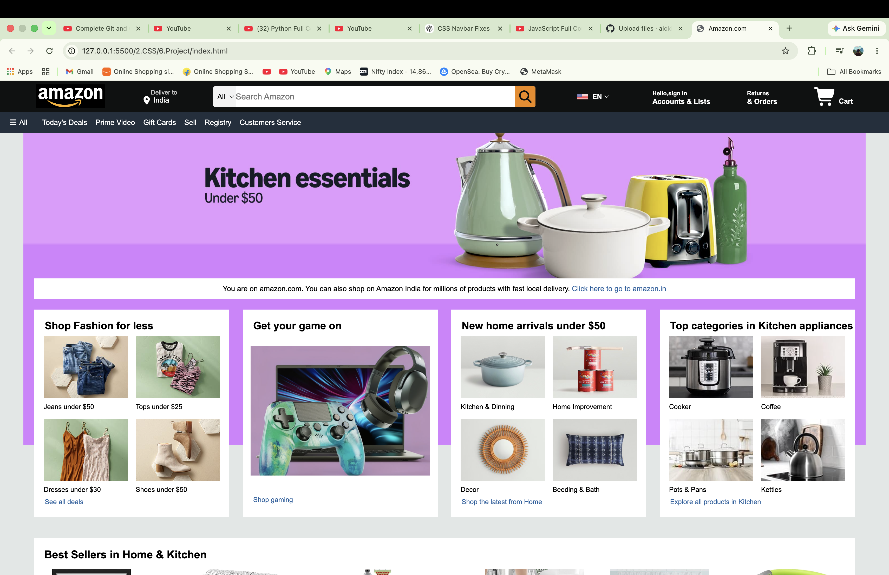

# 🛒 Amazon Clone

A frontend clone of the Amazon homepage built using **HTML5** and **CSS3**. This project recreates the design and user interface of Amazon's homepage, featuring an Amazon-inspired navigation bar, animated hero banner, product showcase sections, best-seller sliders, and footer. It demonstrates clean code organization, modern CSS techniques, and frontend development best practices.

---

## 🌐 Live Demo

🔗 **https://alokkumar-dotcom.github.io/Amazon-clone/**

---

## 📸 Project Preview



---

## ✨ Features

* 🛒 Amazon-inspired Navigation Bar
* 🔍 Search Bar with Category Dropdown
* 🎞️ CSS Animated Hero Banner
* 📦 Product Category Cards
* ⭐ Horizontal Best Seller Sections
* 🛍️ Product Showcase Layout
* 📄 Amazon-style Footer
* 🎨 Font Awesome Icons
* 📁 Clean & Organized Folder Structure
* 💻 Desktop-First Layout

---

## 🛠️ Tech Stack

* HTML5
* CSS3
* Font Awesome

---

## 📂 Project Structure

```text
Amazon-clone/
│
├── images/
│   ├── screenshot.png
│   └── ...
├── index.html
├── style.css
└── README.md
```

---

## 🚀 Getting Started

### Clone the Repository

```bash
git clone https://github.com/alokkumar-dotcom/Amazon-clone.git
```

### Navigate to the Project Folder

```bash
cd Amazon-clone
```

### Run the Project

Open `index.html` in your preferred web browser.

---

## 🌟 Key Highlights

* Built entirely with HTML5 and CSS3
* Amazon-inspired user interface
* Smooth CSS animations
* Organized and maintainable codebase
* Desktop-first design approach
* Deployed with GitHub Pages

---

## 📚 Learning Outcomes

Through this project, I strengthened my understanding of:

* Semantic HTML5
* CSS Flexbox
* CSS Grid
* CSS Animations
* Layout Design
* UI Cloning Techniques
* Project Structure Organization
* Frontend Development Best Practices

---

## 🔮 Future Improvements

* JavaScript-powered Hero Slider
* Fully Responsive Mobile Layout
* Product Search Functionality
* Interactive Navigation Menu
* Dark Mode
* Accessibility Improvements
* Shopping Cart Functionality
* Backend Integration

---

## 👨‍💻 Author

**Alok Kumar**

B.Tech Computer Science & Engineering
IIIT Kottayam

* 💼 **LinkedIn:** https://www.linkedin.com/in/alok-kumar-b19a2835b/
* 💻 **GitHub:** https://github.com/alokkumar-dotcom
* 🌐 **Live Demo:** https://alokkumar-dotcom.github.io/Amazon-clone/

---

## 📄 Disclaimer

This project was created for **educational and portfolio purposes only**. Amazon and its trademarks are the property of Amazon.com, Inc. This project is not affiliated with, endorsed by, or associated with Amazon.

---

## ⭐ Support

If you found this project helpful, please consider giving it a ⭐ on GitHub.
